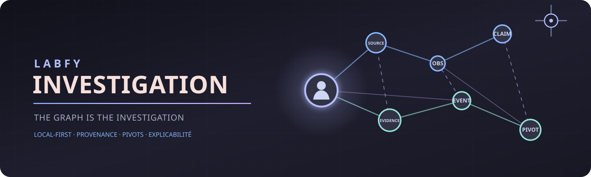

# Labfy Investigation

Le parcours `CURRENT` de jobs locaux persistants et de reprise J5 est documenté
dans [docs/architecture/LOCAL_JOBS_RECOVERY.md](docs/architecture/LOCAL_JOBS_RECOVERY.md).

La [recherche OSINT assistée V1](docs/architecture/OSINT_ASSISTED_RESEARCH.md)
ajoute au JobStore V4 des plans, grants et reçus de policy distincts, validés
uniquement avec des fixtures et un fournisseur loopback `SPECIMEN`. Aucun
fournisseur public n'est configuré ou qualifié ; V20 et V21 ne sont pas modifiés.

Le premier poste Web local pilotable J6 est documenté dans
[docs/architecture/WEB_WORKSPACE_CONTROL.md](docs/architecture/WEB_WORKSPACE_CONTROL.md).

Les fondations Qwen locales, limitées aux workspaces `SPECIMEN`, sont décrites
dans [l'agent opérationnel](docs/architecture/OPERATIONAL_AGENT.md). Le smoke
opérationnel réel unifié sur `SPECIMEN` a atteint `COMPLETED` avec supervision
Qwen, sandbox offline et contact passif `PRIVACY_TOR` sans repli direct :
`PASS_LOCAL_SPECIMEN`. Ce résultat est `CURRENT local`, non publié.

Le premier lot J7 ajoute un index C recalculable et des rapprochements locaux
explicables pour les e-mails, domaines et IP observés :
[pivots locaux et corrélation](docs/architecture/LOCAL_PIVOTS_CORRELATION.md).

Le [poste Web local](docs/ui/WEB_WORKBENCH.md) rassemble désormais une
bibliothèque d’enquêtes explicitement choisie, le graphe, l’inspecteur
contextuel, les tâches, le planner J8 et les rapports J9. Cette disponibilité
locale ne change ni le statut de production, ni l’interdiction d’utiliser une
enquête réelle pendant les validations de développement.

Le déploiement personnel local de `http://invest.labfy` repose sur une unité
systemd utilisateur et un proxy nginx limités à `127.0.0.1`. Sur cette machine,
le service démarre sans inspecter la bibliothèque configurée ; l'utilisateur
charge sa liste, peut [découvrir et enregistrer un dossier existant](docs/architecture/EXISTING_INVESTIGATION_LIBRARY.md)
sous `LABFY_LIBRARY` sans copie, puis ouvre l'enquête. « Fermer l’enquête » vide
le contexte actif avant une autre ouverture. Labfy
démarre le Qwen local configuré dans XDG pour le prompt Agent existant. Les étapes
d’installation et de retrait sont dans le [guide du poste Web](docs/ui/WEB_WORKBENCH.md).

Le provisionnement contrôlé d'outils et les modifications de Labfy préparées
par Qwen sont `CURRENT local` sur `SPECIMEN`. Les portes humaines A/B encadrent
la [toolbox rootless](docs/architecture/TOOL_PROVISIONING.md) et ses
[capabilities dynamiques](docs/architecture/CAPABILITY_MANIFESTS.md). Les portes
C1/C2 encadrent le [worktree de développement isolé](docs/architecture/QWEN_SELF_INTEGRATION.md),
ses tests, son diff et son aperçu avant application. Qwen ne peut ni approuver
ses propositions, ni installer sur l'hôte, ni écrire directement dans `main`.

Le parcours local expérimental d’import et de revue est détaillé dans
[le contrat d’espace local](docs/architecture/LOCAL_WORKSPACE_IMPORT.md) :
l’aperçu EML/PNG/JPEG provient du cœur C après contrôle d’intégrité ; les
originaux et leurs chemins ne sont jamais servis. Confirmer une observation est
une revue, jamais une confirmation d’identité ; créer, rattacher ou retirer un
indicateur reste une action explicite.



[](CHANGELOG.md)
[](docs/ARCHITECTURE.md)
[](docs/ARCHITECTURE.md#23-local-first)
[](LICENSE)
[](#état-du-projet)

> **Forgejo est le dépôt principal.** Le code peut être publié sur GitHub comme
> miroir, mais les tickets, décisions et contributions sont suivis sur
> [git.labfytools.com](https://git.labfytools.com/fy59/labfy-investigation).

Labfy Investigation est un environnement **local-first** d'investigation
numérique centré sur un graphe interactif, dans lequel chaque élément découvert
peut devenir un pivot exploitable par un toolkit extensible.

Il réunit progressivement un graphe d'investigation, un modèle exigeant de
preuve et de provenance, des capacités OSINT contextuelles, un planner
déterministe et une automatisation contrôlée. L'interface doit rester accessible
à un enquêteur novice sans retirer à l'expert l'accès aux détails techniques.

> **THE GRAPH IS THE INVESTIGATION**
>
> Le graphe n'est pas une visualisation secondaire : il est la représentation
> principale de l'enquête.

## Pourquoi Labfy ?

Les outils spécialisés savent souvent collecter ou analyser une catégorie de
données. Labfy vise à relier leurs résultats dans une enquête cohérente :

- préserver les sources et les artefacts bruts ;
- normaliser les résultats sans perdre leur origine ;
- relier entités, observations, événements, preuves et hypothèses ;
- proposer les pivots applicables au contexte sélectionné ;
- expliquer chaque corrélation et chaque recommandation ;
- limiter l'automatisation par le budget, le risque et le scope autorisé ;
- produire des résultats vérifiables et exportables.

## État du projet

La cible de développement est **v0.1.0**. Le projet reste en développement actif
et n'est pas prêt pour un usage opérationnel en production.

**Web est l’interface utilisateur CURRENT ; GTK est supprimé.** La fondation
v0.1.0 reste en développement : le poste local réutilise le moteur de jobs
persistant, la bibliothèque explicitement choisie et les capabilities C, sans
constituer une autonomie générale ni un service distant.

### Disponible aujourd'hui

Le produit actuel est un poste Web local-first devant le cœur C17. Il fournit
notamment :

- création et ouverture d'enquêtes autonomes avec SQLite versionné ;
- import contrôlé de preuves, copies locales et empreintes SHA-256 ;
- entités, relations, rattachements aux preuves et graphe interactif ;
- positions et viewport du graphe persistants ;
- tâches asynchrones annulables et panneau d'activité ;
- registre initial d'outils externes et exécution via `GSubprocess` sans shell ;
- pivot DNS révisable avec provenance des exécutions ;
- analyse locale EML, MIME, PDF, OCR et métadonnées ExifTool ;
- observations persistantes, promotion explicite vers une entité et retrait
  réversible ;
- personnes, rôles contextuels, comptes sociaux et champs structurés ;
- OCR d'identité contrôlé, historique multi-run et corrections humaines ;
- appréciations humaines append-only, distinctes des résultats automatiques.

Cette liste décrit l'existant ; elle ne promet ni stabilité d'API ni couverture
fonctionnelle complète. Le code, les tests et les migrations restent la source
de vérité technique.

### Planifié pour Labfy V2

Les éléments suivants constituent l'architecture cible et **ne sont pas encore
disponibles comme système intégré** :

- frontend Web local-first remplaçant progressivement GTK ;
- projection unifiée du graphe pour Identity, Infrastructure, Finance,
  Timeline, Geo et Evidence ;
- compression sémantique, focus workspace et navigation de grands graphes ;
- registre générique d'adapters et de capabilities ;
- job engine persistant et récupérable après crash ;
- moteur de pivots avec déduplication, cycles et budgets ;
- corrélations déterministes, versionnées et explicables ;
- planner d'investigation déterministe ;
- politiques d'autonomie progressive et contrôle de scope ;
- provenance navigable de bout en bout.

Voir la [roadmap canonique](docs/ROADMAP.md) pour l'ordre prévu.

Une [démonstration Web Graph J2](prototypes/web-graph/README.md), explicitement
expérimentale, en lecture seule et alimentée uniquement par des fixtures
synthétiques, permet désormais d'éprouver les contrats et interactions cibles.
Un premier lot J3 ajoute un mode séparé où une fixture SQLite V20 est créée par
les API C de production, relue par des services C effectivement read-only puis
affichée via un [snapshot cœur documenté](docs/architecture/CORE_GRAPH_READONLY.md).
Une extension J3 exécute aussi l'analyseur EML natif sur une preuve synthétique,
publie dérivé, extraction et observations proposées en V20, puis les relit dans
un [snapshot v3 affiché par le Web](docs/architecture/EML_ANALYSIS_TO_GRAPH.md).
Cette connexion locale reste synthétique et ne constitue pas un backend Web de
production ni une autorisation de charger une enquête réelle.

## Principes fondamentaux

### The graph is the investigation

Personnes, organisations, identifiants, comptes, infrastructure, transactions,
événements, preuves, sources, observations, claims et hypothèses doivent pouvoir
être projetés dans le même réseau logique.

Cela ne signifie pas qu'ils deviennent tous des lignes de la table générique
`entites`. Le modèle métier continue de distinguer :

```text
entities      artifacts      evidence       observations
events        transactions   claims         hypotheses
sources       executions     transformations
```

Le graphe Web cible sera une projection de ces objets, pas une seconde base de
données.

### Une enquête, plusieurs projections

```text
                    INVESTIGATION GRAPH
                           │
          ┌────────────────┼────────────────┐
          │                │                │
       Identity       Infrastructure      Finance
          │                │                │
       Timeline            Geo           Evidence
```

Ces vues partagent les mêmes objets et la même provenance. Elles ne créent ni
bases ni graphes indépendants.

### Why do we know this?

Depuis une relation, une observation, un claim ou une hypothèse, l'utilisateur
doit pouvoir remonter jusqu'à la source :

```text
ENTITY / CLAIM
      ↑
OBSERVATION
      ↑
TRANSFORMATION
      ↑
NORMALIZED RESULT
      ↑
EXECUTION
      ↑
RAW SOURCE
      ↑
TOOL / QUERY / PARAMETERS
```

### Une hypothèse n'est pas un fait

Un même username, avatar, téléphone, e-mail, domaine, certificat ou IP peut
produire un signal. Il ne doit jamais devenir silencieusement une identité
confirmée.

La direction v0.1.0 distingue la nature de l'information — `OBSERVED`,
`DECLARED`, `DERIVED`, `CORRELATED`, `INFERRED` — de sa revue humaine et de
l'état d'une hypothèse.

La confiance cible est qualitative et justifiée : `UNKNOWN`, `LOW`,
`MODERATE`, `HIGH`. Aucun score opaque ne remplace les raisons ni la décision
humaine.

### Local-first

Par défaut, SQLite, artefacts, preuves, graphe et moteur restent locaux. Les
technologies Web désignent l'interface locale cible ; elles n'impliquent ni
cloud Labfy ni transfert automatique des données d'enquête.

Les accès réseau correspondent uniquement aux recherches explicitement
effectuées par des adapters, sous contrôle des politiques applicables.

## Interface et expérience cible

Le Web est l’interface fonctionnelle unique, avec le graphe comme espace de
travail central. Sa coque organise **Agent | Graphe | Activité**, complétée par
un drawer transversal de détails, provenance, timeline, recherches,
observations, finance, rapports et tâches. Le
[protocole d’outils agent V1](docs/architecture/AGENT_TOOL_PROTOCOL.md) fournit
un fake borné qui relit les snapshots backend et prépare l’autorisation de
recherche sans l’accorder. Le [runtime local configurable](docs/architecture/LOCAL_MODEL_AGENT_RUNTIME.md)
ajoute un fournisseur OpenAI-compatible strictement loopback validé sur fake
`SPECIMEN` ; Qwen réel et sa supervision sont `CURRENT local` après le smoke
unifié. Le governor AMD/RAM/swap reste `TARGET`.

La cible comprend :

- **semantic clustering**, collapse/expand et niveaux de détail ;
- filtres temporels, relationnels et de confiance ;
- isolation de chemins et mode focus ;
- **Focus Workspace** regroupant voisinage, observations, preuves, timeline,
  hypothèses, actions et pivots ;
- actions métier lisibles pour le novice ;
- drill-down complet vers outils, versions, paramètres, stdout, stderr,
  artefacts bruts et transformations pour l'expert.

L'identité visuelle cible repose sur **Catppuccin Mocha**, avec **Lavender**
comme accent principal et un design system centralisé.

## Toolkit contextuel

Le frontend ne connaîtra pas une liste codée en dur de commandes. Il demandera
au cœur : « Que puis-je faire avec cet objet ? » et consommera des
`capabilities` publiées par le **Labfy Toolkit Registry**.

Premiers candidats évalués pour la roadmap : ExifTool, Tesseract, qpdf, RDAP,
Certificate Transparency, Wayback, Subfinder, theHarvester et Maigret.
Sherlock, Amass, dnsx, httpx, Katana, SpiderFoot, Nominatim et GraphSense restent
des candidats spécialisés ou optionnels.

Ces noms ne signifient pas que les outils sont déjà intégrés. Chaque intégration
exigera licence compatible, version qualifiée, exécution bornée, normalisation,
provenance et tests synthétiques.

## Architecture cible

```text
┌───────────────────────────────────────────────┐
│                 WEB FRONTEND                  │
│       INVESTIGATION GRAPH — MAIN UI           │
│ Dashboard / Graph / Timeline / Evidence       │
│ Finance / Infrastructure / Geo / Reports      │
└──────────────────────┬────────────────────────┘
                       │ HTTP API / EVENTS
┌──────────────────────▼────────────────────────┐
│                  LABFY CORE                   │
│ Evidence / Provenance                         │
│ Entity & Observation Model                    │
│ Adapter Registry / Job Engine / Pivot Engine  │
│ Correlation / Planner / Scope / Policy        │
└──────────────────────┬────────────────────────┘
                       │
                     SQLite
```

C17 reste le socle lorsqu'il sert l'intégrité, SQLite, la provenance,
l'orchestration et les services principaux. L'architecture peut employer
Python, JavaScript/TypeScript, SQL, shell strictement contrôlé, CLI externes et
API HTTP lorsque le bénéfice est établi. Aucun framework Web n'est décidé dans
cette tranche.

La conception détaillée se trouve dans [docs/ARCHITECTURE.md](docs/ARCHITECTURE.md).

## Construire et tester

Les dépendances et procédures Arch Linux et Ubuntu sont décrites dans
[docs/DEPENDENCE.md](docs/DEPENDENCE.md).

```bash
make -j8
make test
tools/labfy
```

La démonstration cœur/Web synthétique se lance séparément :

```bash
make -j8 core-graph-demo
make -j8 eml-graph-demo
make -j8 local-toolkit-demo
cd prototypes/web-graph
python3 run_core_demo.py --port 8765
# ou : python3 run_eml_demo.py --port 8765
# ou : python3 run_local_toolkit_demo.py --port 8765
```

outils d'analyse sont optionnels et ne sont jamais installés automatiquement.
Le projet exige C17, GLib/GIO, SQLite, libheif et Poppler GLib. GTK4 n’est plus
une dépendance de compilation. Plusieurs outils d'analyse sont optionnels et
ne sont jamais installés automatiquement.
outils d'analyse sont optionnels et ne sont jamais installés automatiquement.

Le poste Web local se lance depuis une bibliothèque explicitement désignée ;
il écoute par défaut sur `127.0.0.1:8081` :

```bash
LABFY_LIBRARY=/chemin/vers/la-bibliotheque-locale tools/labfy
```

Le lanceur rejoint ou démarre une instance locale possédée, ouvre le navigateur
et établit une session HttpOnly sans code manuel ni jeton dans l’URL. Les
contrats de stockage local et de session sont décrits dans
[le contrôle du poste Web](docs/architecture/WEB_WORKSPACE_CONTROL.md).

## Documentation

- [Index documentaire](docs/README.md)
- [Architecture actuelle et cible](docs/ARCHITECTURE.md)
- [Contrat du graphe](docs/architecture/INVESTIGATION_GRAPH.md)
- [Projection cœur → Web en lecture seule](docs/architecture/CORE_GRAPH_READONLY.md)
- [Décisions architecturales](docs/architecture/decisions/0001-web-local-first.md)
- [Toolkit et statuts d'intégration](docs/osint/TOOLKIT.md)
- [Toolkit local et runner borné J4](docs/architecture/LOCAL_TOOLKIT_RUNNER.md)
- [Recherche OSINT assistée V1 en laboratoire](docs/architecture/OSINT_ASSISTED_RESEARCH.md)
- [Design system cible](docs/ui/DESIGN_SYSTEM.md)
- [Matrice de parité Web / GTK](docs/ui/WEB_GTK_PARITY.md)
- [Sécurité, scope et secrets](docs/security/SECURITY_MODEL.md)
- [Roadmap canonique](docs/ROADMAP.md)
- [Backlog préparé](docs/BACKLOG.md)
- [Architecture de la base](docs/database/DATABASE_ARCHITECTURE.md)
- [Audit du schéma courant](docs/database/SCHEMA_AUDIT_CURRENT.md)
- [Dépendances](docs/DEPENDENCE.md)
- [Développement](docs/DEVELOPMENT.md)
- [Conventions](docs/CONVENTIONS.md)
- [Changelog](CHANGELOG.md)
- [Source SVG éditable de la bannière](resources/images/labfy-investigation-banner.svg)

## Sécurité et usage responsable

Labfy est destiné aux sources légalement accessibles, aux données remises
légalement et aux actions explicitement autorisées. Le projet n'automatise pas
l'intrusion, le contournement d'authentification, l'exploitation de
vulnérabilités, le phishing ou l'accès non autorisé à des données privées.

L'architecture cible distingue `PASSIVE`, `PUBLIC_ACTIVE`,
`AUTHORIZED_INTRUSIVE` et `PROHIBITED`, ainsi que les effets `READ_ONLY`,
`STATE_CHANGING`, `DESTRUCTIVE`, `PERSISTENCE`, `CREDENTIAL_ACCESS` et
`DATA_EXTRACTION`. Les capacités intrusives ne font pas partie de v0.1.0 et
nécessiteraient un scope et une autorisation explicites.

## Contribution

Avant une contribution :

1. consulter les tickets Forgejo ;
2. lire [AGENTS.md](AGENTS.md), l'architecture et les conventions ;
3. limiter la modification à un objectif cohérent ;
4. ajouter ou adapter les tests ;
5. exécuter la validation complète ;
6. documenter toute dérogation architecturale.

## Licence

Labfy Investigation est distribué sous licence MIT. Voir [LICENSE](LICENSE).
# J8 local : planner assisté

Le parcours synthétique de recommandations, plans persistants et budgets se
lance avec `make web-workspace-j8 WORKSPACE=/tmp/labfy-j8-specimen`. Voir
[`docs/architecture/LOCAL_PLANNER_ASSISTED.md`](docs/architecture/LOCAL_PLANNER_ASSISTED.md).

# J9 local : preuves, chronologie et rapport

Le poste Web propose désormais les projections Preuves, Chronologie et
Infrastructure locale, une sélection minimisée et un dossier HTML/JSON/PDF
vérifiable hors ligne. Le parcours synthétique se lance avec
`make web-workspace-j9 WORKSPACE=/tmp/labfy-j9-specimen`. Voir
[`docs/architecture/EVIDENCE_TIMELINE_REPORT.md`](docs/architecture/EVIDENCE_TIMELINE_REPORT.md).
Le PDF Unicode, la minimisation par section, le vérificateur hostile et la
reprise d’intention sont couverts par la matrice d’intégrité J9 locale.

# Espace local vide et import navigateur

Le parcours `CURRENT` sans corpus préinséré se lance sur une destination
explicitement autorisée :

```sh
make web-workspace-local WORKSPACE=/tmp/labfy-local-workspace
```

Le workbench s’ouvre directement ; créer l’enquête puis utiliser **Ajouter des
preuves** pour sélectionner des EML, PNG ou JPEG (4 Mio par fichier). La
réception, la confirmation, le planner, les analyses, le graphe et les rapports
restent séparés. La réouverture reprend le même UUID sans exemple ni duplication.
Les plafonds de sélection, staging et concurrence sont réservés côté serveur ;
un rejeu ne réussit qu’après revalidation du record et de l’original publié.
Voir [le contrat d’import local](docs/architecture/LOCAL_WORKSPACE_IMPORT.md).

Pour le contrôle ciblé de cette tranche, utiliser uniquement un workspace
temporaire `SPECIMEN` et la cible `make web-workspace-review-check`. Cette
cible ne constitue ni une certification de sécurité ou de production, ni une
validation de sanitizers ou un résultat canonique pour un navigateur donné.
