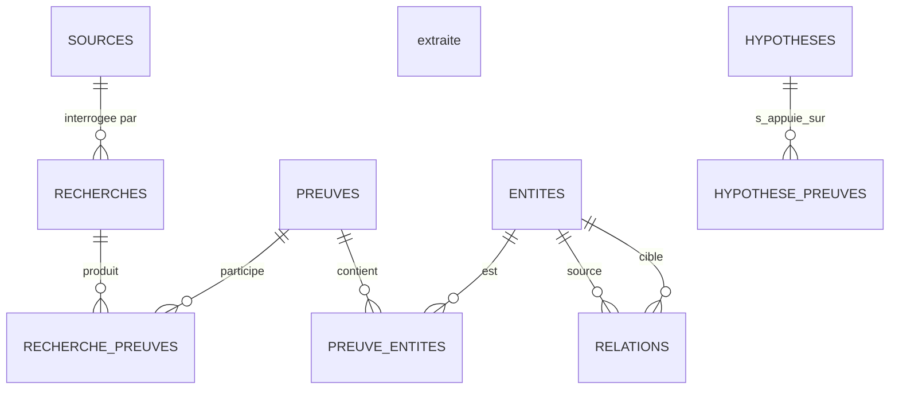

# Ticket #024

## Titre

Documenter l'architecture de la base de données V1.

---

## Objectif

Créer une documentation de référence expliquant l'architecture SQLite V1 de
Labfy Investigation.

Cette documentation doit permettre à un développeur de comprendre :

- le rôle de chaque table ;
- les relations entre les objets métier ;
- les conventions d'identifiants ;
- les règles sur les dates ;
- la suppression logique ;
- les tables de liaison ;
- les contraintes d'intégrité ;
- la politique de versionnement du schéma.

Le document ne doit pas recopier intégralement le SQL.

Il doit expliquer le modèle et les décisions prises.

---

## Livrable principal

Créer :

```text
docs/database/DATABASE_ARCHITECTURE.md
```

---

## Sources de référence

La documentation doit rester cohérente avec :

```text
database/schema_v1.sql
docs/database/SCHEMA_AUDIT_V1.md
docs/CONVENTIONS.md
```

En cas de contradiction, le schéma SQL exécuté fait foi jusqu'à correction de
la documentation.

---

## Contenu attendu

### 1. Vue d'ensemble

Présenter le rôle de la base SQLite dans une enquête.

Chaque enquête possède sa propre base :

```text
00_BaseDeDonnees/Enquete.sqlite
```

La base est autonome et liée au dossier d'enquête.

---

### 2. Principes généraux

Documenter les choix suivants :

- une base par enquête ;
- aucun chemin absolu dans les objets métier ;
- UUID pour les objets métier ;
- identifiants entiers pour les tables de référence ;
- dates UTC au format ISO 8601 ;
- clés étrangères activées ;
- suppression logique ;
- requêtes préparées obligatoires dans le code C ;
- aucune requête SQL métier hors du module Database.

---

### 3. Domaines du modèle

Présenter les grands ensembles :

```text
Métadonnées
Référentiels
Collecte
Connaissance
Raisonnement
Traçabilité
Classification
```

Exemple de classement :

```text
Métadonnées
├── metadata
└── investigation

Référentiels
├── types_preuve
├── types_entite
├── types_source
└── types_outil

Collecte
├── sources
├── recherches
└── preuves

Connaissance
├── entites
└── relations

Raisonnement
└── hypotheses

Traçabilité
├── chronologie
└── journal

Classification
├── categories
└── tags
```

---

### 4. Chaîne d'investigation

Décrire le flux métier principal :

```text
Source
   ↓
Recherche
   ↓
Preuve
   ↓
Entité
   ↓
Relation
   ↓
Hypothèse
```

Préciser que ce flux n'est pas strictement linéaire.

Une recherche peut :

- utiliser une preuve existante ;
- produire plusieurs preuves ;
- découvrir plusieurs entités ;
- confirmer ou contredire une relation ;
- enrichir une hypothèse.

---

### 5. Description des tables métier

Pour chaque table importante, documenter :

- responsabilité ;
- identifiant ;
- colonnes principales ;
- relations ;
- suppression ;
- points d'attention.

Tables concernées :

```text
investigation
sources
recherches
preuves
entites
relations
chronologie
journal
hypotheses
categories
tags
```

---

### 6. Tables de liaison

Documenter le rôle des tables de liaison :

```text
recherche_preuves
recherche_entites
recherche_relations
recherche_hypotheses

preuve_entites
relation_preuves

recherche_chronologie
preuve_chronologie
entite_chronologie
relation_chronologie

hypothese_preuves
hypothese_entites
hypothese_relations

tag_preuves
tag_recherches
tag_entites
tag_relations
tag_hypotheses
tag_chronologie
```

Expliquer :

- les clés primaires composites ;
- l'interdiction des doublons ;
- les colonnes `role` lorsqu'elles existent ;
- le comportement `ON DELETE`.

---

### 7. Relations principales

Inclure un diagramme textuel ou Mermaid.

Exemple :



Le diagramme peut être simplifié afin de rester lisible.

---

### 8. Identifiants

Expliquer :

```sql
id TEXT PRIMARY KEY
```

pour les objets métier.

Préciser :

- UUID généré dans l'application ;
- pas de colonne `uuid` supplémentaire ;
- aucune dépendance aux numéros de ligne SQLite ;
- meilleure portabilité pour l'import, l'export et la fusion.

---

### 9. Dates

Expliquer la différence entre :

```text
created_at
updated_at
imported_at
file_created_at
started_at
completed_at
event_time
```

Toutes les dates techniques sont enregistrées en UTC.

---

### 10. Suppression logique

Documenter les statuts comme :

```text
active
archived
deleted
```

Préciser que :

- les preuves originales ne sont pas modifiées ;
- les objets supprimés logiquement restent référencés ;
- les purges physiques sont hors des opérations ordinaires ;
- le journal est append-only dans le fonctionnement normal.

---

### 11. Intégrité

Documenter :

- `PRAGMA foreign_keys = ON` ;
- contraintes `NOT NULL` ;
- contraintes `CHECK` ;
- contraintes `UNIQUE` ;
- clés primaires composites ;
- validation applicative complémentaire.

Préciser que SQLite ne suffit pas à valider :

- la syntaxe réelle d'un UUID ;
- la validité complète d'une couleur ;
- la normalisation d'une adresse email ;
- la validité d'un IBAN ;
- l'existence d'une référence polymorphe du journal.

---

### 12. Index

Expliquer que les index couvrent principalement :

- les clés étrangères ;
- les statuts ;
- les dates ;
- les hashes ;
- les valeurs recherchées ;
- les catégories ;
- les relations orientées.

Le document ne doit pas recopier chaque index sans explication.

---

### 13. Versionnement

Documenter :

```text
schema_version = 1
```

Préciser :

- aucune modification destructive d'une V1 publiée ;
- toute évolution incompatible nécessite une migration ;
- les migrations devront être transactionnelles ;
- une sauvegarde devra précéder toute migration ;
- le schéma V1 reste la référence jusqu'à publication d'une V2.

---

### 14. Couche C

Documenter l'organisation prévue :

```text
include/database/
src/database/
```

Avec un module par objet métier :

```text
preuve.c
entite.c
relation.c
source.c
recherche.c
chronologie.c
journal.c
hypothese.c
categorie.c
tag.c
```

Le document doit préciser que cette organisation représente la cible
d'architecture, même si tous les modules ne sont pas encore implémentés.

---

## Hors périmètre

Ce ticket ne doit pas :

- modifier le schéma SQL ;
- ajouter de table ;
- écrire un CRUD ;
- ajouter une migration ;
- modifier GTK ;
- intégrer GResource ;
- modifier le packaging.

Toute incohérence réellement détectée doit être documentée avant de faire
l'objet d'un ticket de correction séparé.

---

## Critères d'acceptation

- [ ] `DATABASE_ARCHITECTURE.md` existe.
- [ ] Le rôle de chaque table métier est expliqué.
- [ ] Les tables de liaison sont documentées.
- [ ] Les UUID sont expliqués.
- [ ] Les dates sont expliquées.
- [ ] La suppression logique est expliquée.
- [ ] Les contraintes d'intégrité sont expliquées.
- [ ] La politique de migrations est définie.
- [ ] Un diagramme global est présent.
- [ ] Le document est cohérent avec `schema_v1.sql`.
- [ ] Aucun changement fonctionnel n'est introduit.
- [ ] `make test` reste entièrement valide.

---

## Commit attendu

```text
docs(database): document v1 database architecture
```
